# JS-Array-Methods

## Concat

The concat() method is used to merge two or more arrays.

*Change the existing array = No*  
*Return -> New Array*

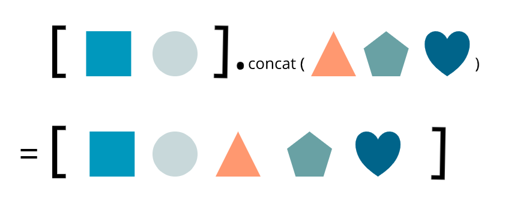

## Copywithin

The copyWithin() method shallow copies part of an array to another location in the same

*Change the existing array = yes*  
*Return -> New Array*

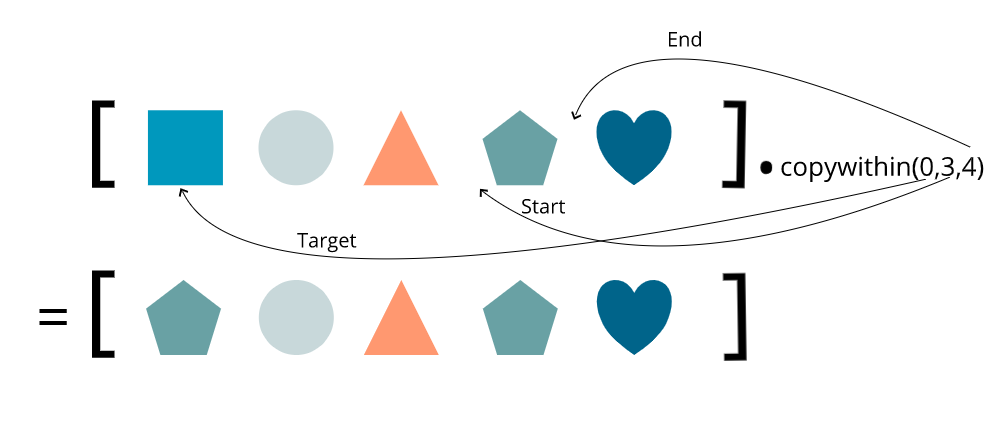

## Every

The every() method tests whether all elements in the array pass the test implemented by the provided function. It returns a Boolean value.  

*Change the existing array = No*  
*Return -> Boolean*

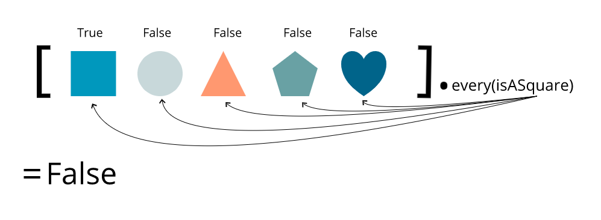

## Fill

The fill() method changes all elements in an array to a static value, from a start index (default 0) to an end index (default array.length). It returns the modified array.  

*Change the existing array = Yes*  
*Return -> New Array*

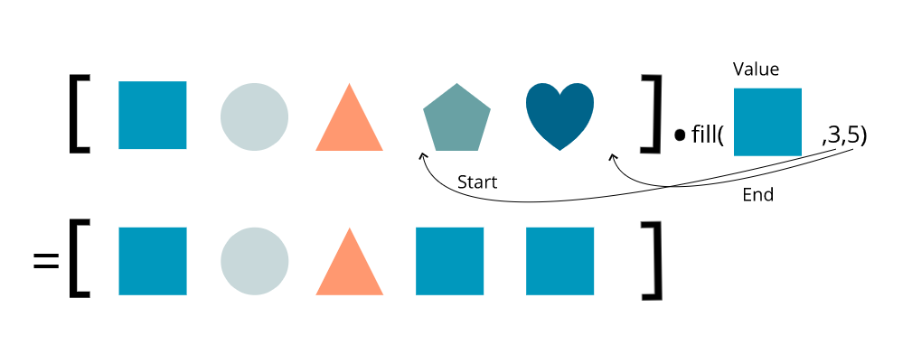

## Filter

The filter() method creates a new array with all elements that pass the test implemented by the provided function.  

*Change the existing array = No*  
*Return -> New Array*

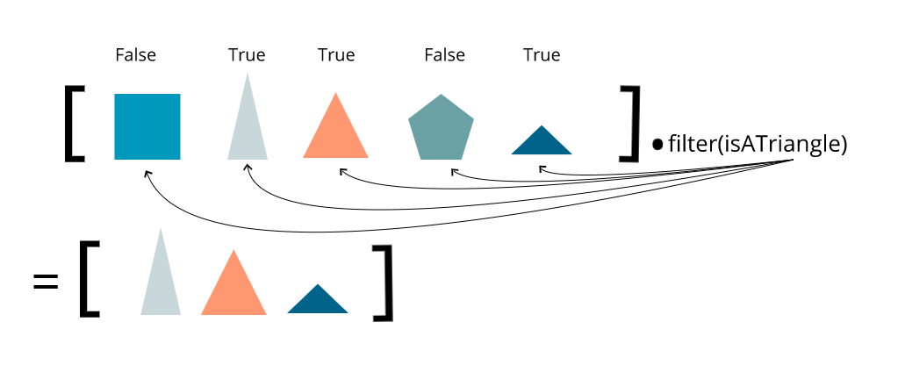

## Find

The find() method returns the value of the first element in the provided array that satisfies the provided testing function. If no values satisfies the testing function, undefined is returned.

*Change the existing array = No*  
*Return -> Value*

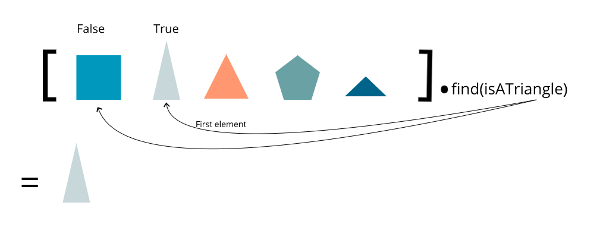

## FindIndex

The findIndex() method returns the index of the first element in the array that satisfies the provided testing function. Otherwise, it returns -1, indicating that no element passed the test.

*Change the existing array = No*  
*Return -> Index*

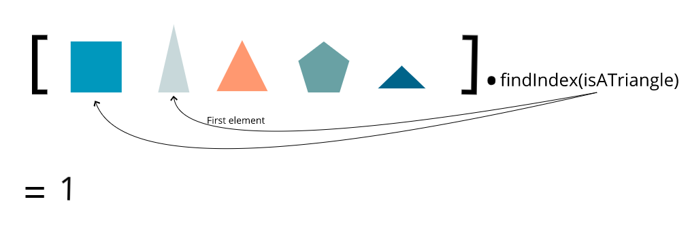

## Flat

The flat() method creates a new array with all sub-array elements concatenated into it recursively up to the specified depth.

*Change the existing array = No*  
*Return -> new Array*

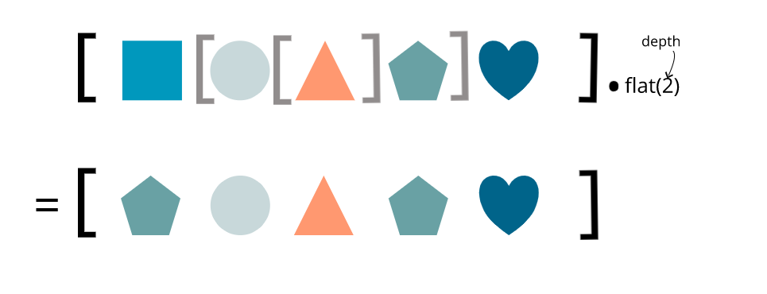

## FlatMap

The flatMap() method returns a new array formed by applying a given callback function to each element of the array, and then flattening the result by one level. It is identical to a map() followed by a flat() of depth 1, but slightly more efficient than calling those two methods separately.

*Change the existing array = No*  
*Return -> new Array*

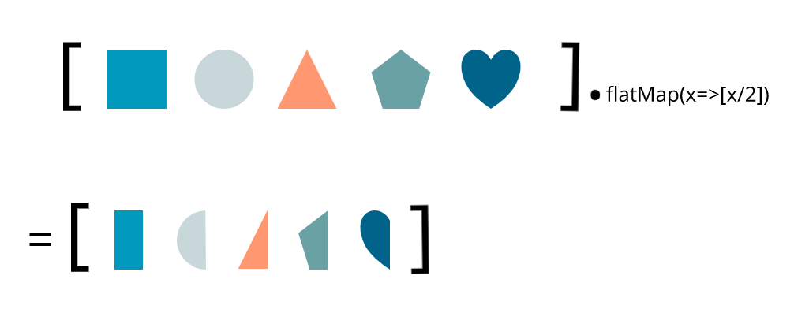

## ForEach

The forEach() method executes a provided function once for each array element.

*Change the existing array = No*  
*Return -> undefined*

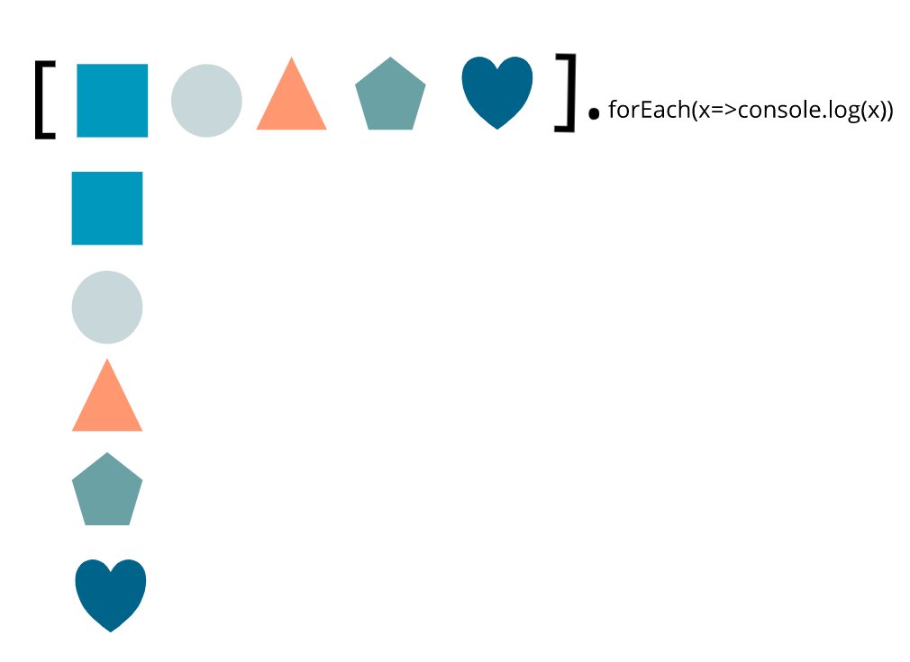

## From

The Array.from() static method creates a new, shallow-copied Array instance from an array-like or iterable object.

*Change the existing array = No*  
*Return -> new Array*

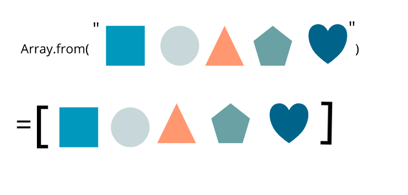

## Includes

The includes() method determines whether an array includes a certain value among its entries, returning true or false as appropriate.

*Change the existing array = No*  
*Return -> Boolean*

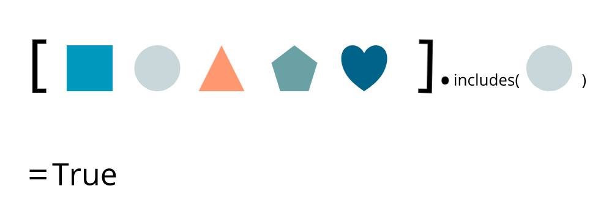

## IndexOf

The indexOf() method returns the first index at which a given element can be found in the array, or -1 if it is not present.

*Change the existing array = No*  
*Return -> Index*

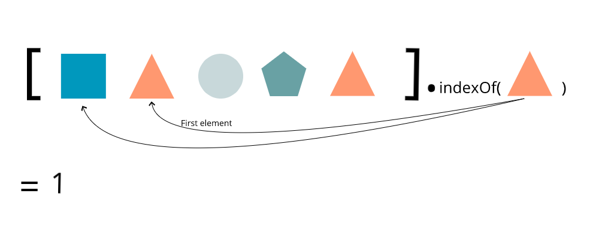

## IsArray

The Array.isArray() method determines whether the passed value is an Array.

*Change the existing array = No*  
*Return -> Boolean*

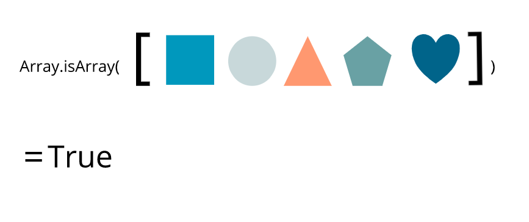

## Join

The join() method creates and returns a new string by concatenating all of the elements in an array (or an array-like object), separated by commas or a specified separator string. If the array has only one item, then that item will be returned without using the separator.  

*Change the existing array = No*  
*Return -> String*

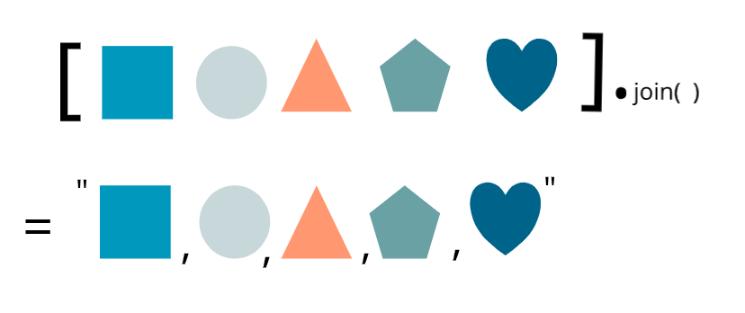

## LastIndexOf

The lastIndexOf() method returns the last index at which a given element can be found in the array, or -1 if it is not present. The array is searched backwards, starting at fromIndex.

*Change the existing array = No*  
*Return -> Index*

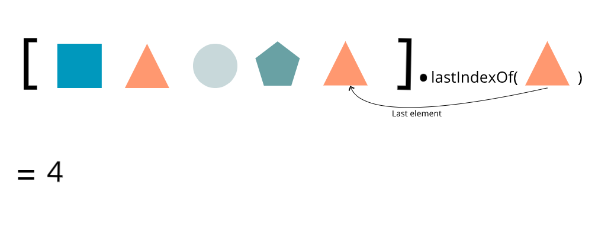

## Map

The map() method creates a new array populated with the results of calling a provided function on every element in the calling array.

*Change the existing array = No*  
*Return -> new Array*

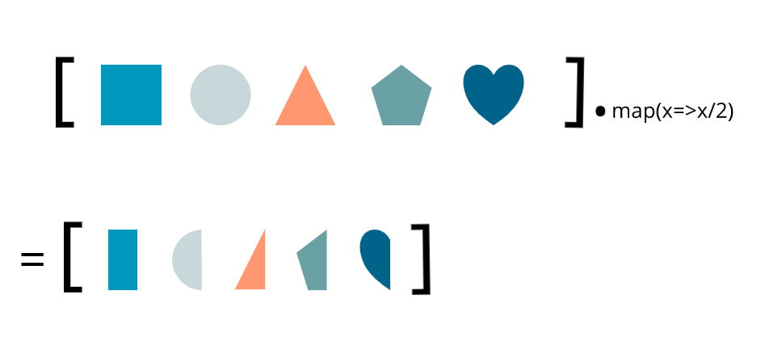

## Of

The Array.of() method creates a new Array instance from a variable number of arguments, regardless of number or type of the arguments.

*Change the existing array = No*  
*Return -> new Array*

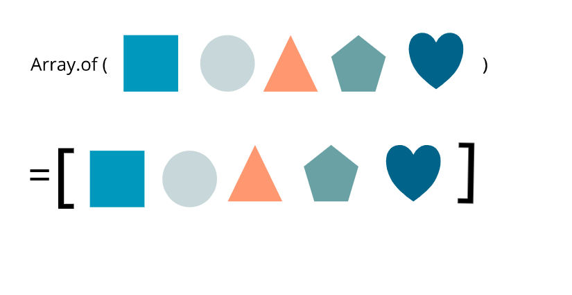

## Pop

The pop() method removes the last element from an array and returns that element. This method changes the length of the array.

*Change the existing array = yes*  
*Return -> Removed Element*

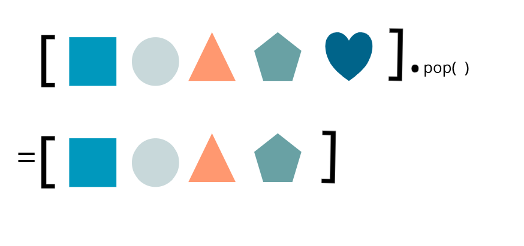

## Push

The push() method adds one or more elements to the end of an array and returns the new length of the array.

*Change the existing array = yes*  
*Return -> New Length*

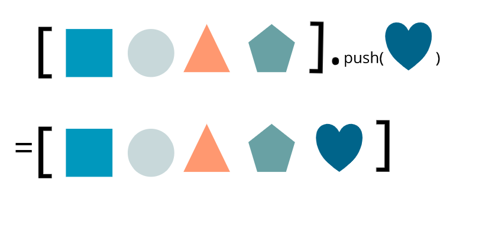

## Reduce

The reduce() method executes a reducer function (that you provide) on each element of the array, resulting in single output value.

*Change the existing array = No*  
*Return -> Reduced Value*

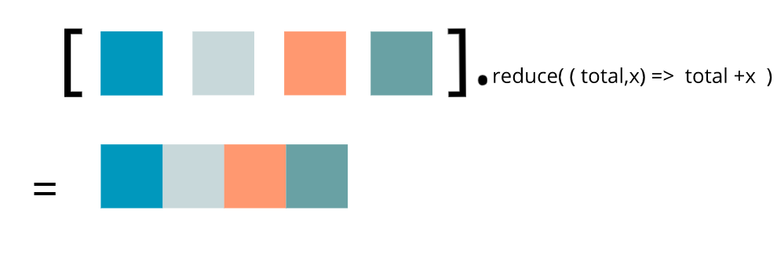

## ReduceRight

The reduceRight() method applies a function against an accumulator and each value of the array (from right-to-left) to reduce it to a single value.

*Change the existing array = No*  
*Return -> Reduced Value*

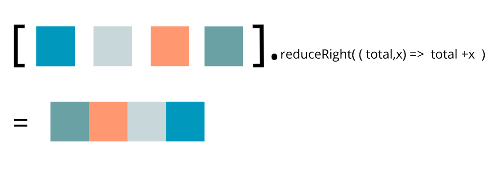

## Reverse

The reverse() method reverses an array in place. The first array element becomes the last, and the last array element becomes the first.

*Change the existing array = Yes*  
*Return -> New Array*

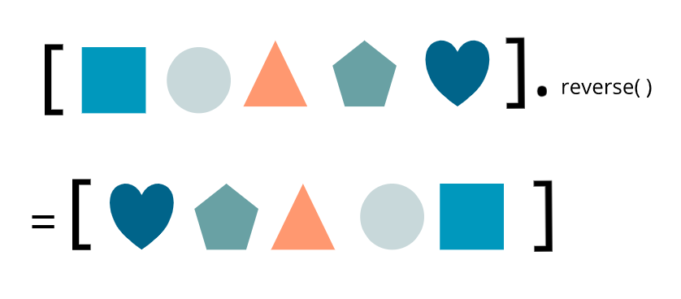

## Shift

The shift() method removes the first element from an array and returns that removed element. This method changes the length of the array.

*Change the existing array = Yes*  
*Return -> Removed Element*

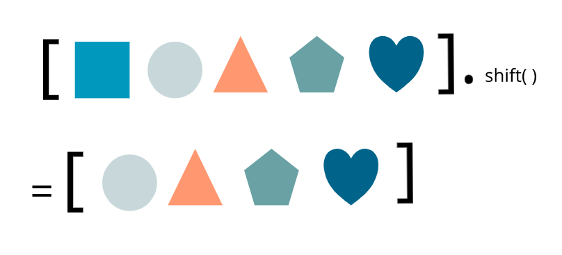

## Slice

The slice() method returns a shallow copy of a portion of an array into a new array object selected from start to end (end not included) where start and end represent the index of items in that array. The original array will not be modified.

*Change the existing array = No*  
*Return -> New Array*

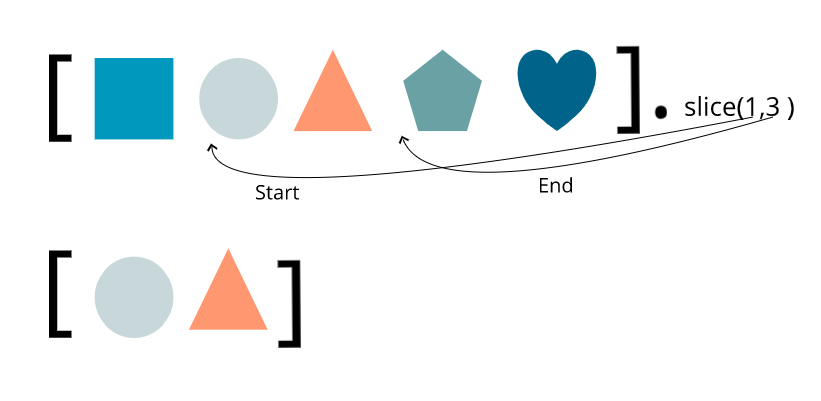

## Some

The some() method tests whether at least one element in the array passes the test implemented by the provided function. It returns a Boolean value.

*Change the existing array = No*  
*Return -> Boolean*

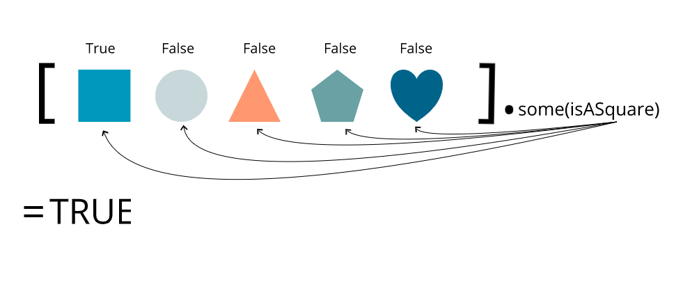

## Sort

The sort() method sorts the elements of an array in place and returns the sorted array. The default sort order is ascending, built upon converting the elements into strings, then comparing their sequences of UTF-16 code units values.

*Change the existing array = Yes*  
*Return -> New Array*

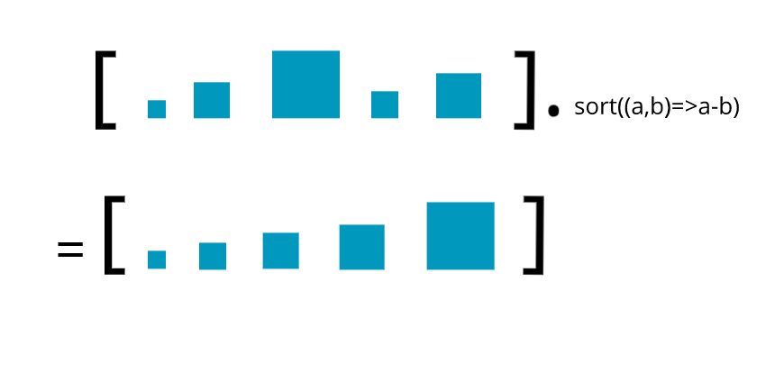

## Splice

The splice() method changes the contents of an array by removing or replacing existing elements and/or adding new elements in place.

*Change the existing array = Yes*  
*Return -> Removed Element*

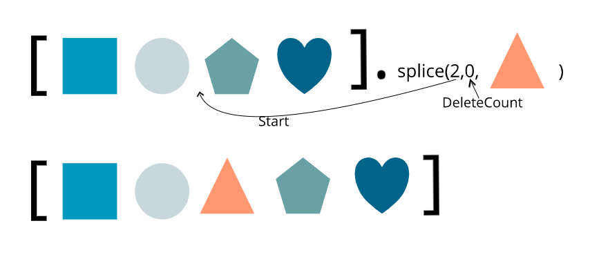

## Unshift

The unshift() method adds one or more elements to the beginning of an array and returns the new length of the array.

*Change the existing array = Yes*  
*Return -> New Length*

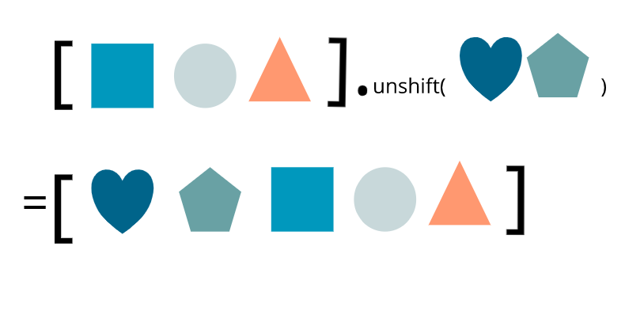

